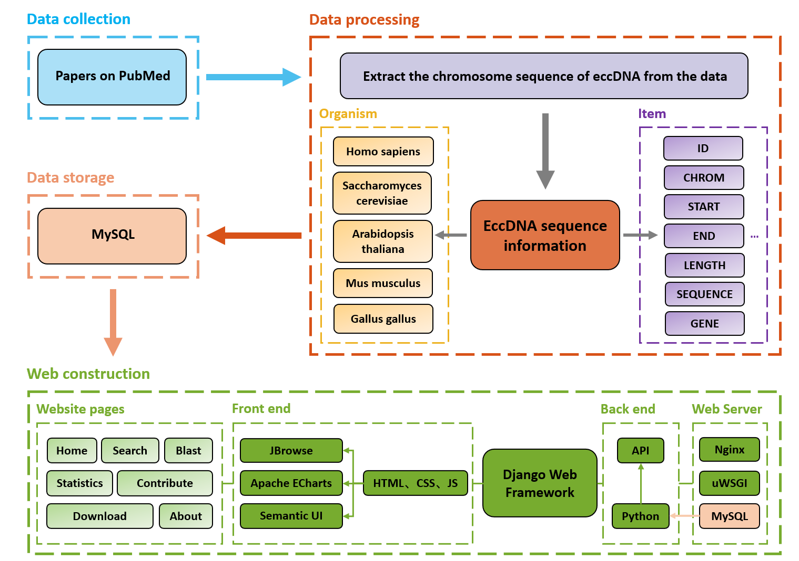

Welcome to TeCD: <a href="http://122.224.251.240:2022/" target="_blank">The eccDNA Collection Database</a>

In eukaryotes, there is a special class of circular DNA molecules, which are separated or detached from the normal genome, dissociated from the chromosome genome, and participate in physiological or pathological processes in a special way. Because they are independent DNA molecules outside the chromosome, they are collectively referred to as extrachromosomal DNA, and they are often circular, so they are called extrachromosomal circular DNA, or eccDNA for short. The particles of eccDNA is usually less than 1 kb and invisible by light microscopy. TeCD attempts to collect all existing information about eccDNA. For now, TeCD has been collecting the molecular information of eccDNA for animals, plants and fungi. The researchers can search the gene or location associated eccDNA from TeCD, and detect the sequence associated genes by BLAST tool.

## References
- Paper Link: [TeCD: The eccDNA Collection Database for extrachromosomal circular DNA.](https://doi.org/10.1186/s12864-023-09135-5)
- Chinese Report: [TeCD一个染色体外环状DNA数据库](https://mp.weixin.qq.com/s/ehqY2_ghbmh9tiEpBQ5Abg)